<style>
strong {
    color:#00F9A5;
    size: 100px;
    margin: 0em;
    font-size: large;
    font-style: italic;
}
</style>

# rtmp 协议
RTMP在收发数据的时候并不是以Message为单位的，而是把Message拆分成Chunk发送，而且必须在一个Chunk发送完成之后才能开始发送下一个Chunk。每个Chunk中带有MessageID代表属于哪个Message，接受端也会按照这个id来将chunk组装成Message。


1. 简单握手  
C&emsp;&emsp;&emsp;&emsp;&emsp;&emsp;&emsp;&emsp;&emsp;&emsp;&emsp;&emsp;S  
|&emsp;&emsp;&emsp;&emsp;&emsp;&emsp;&emsp;&emsp;&emsp;&emsp;&emsp;&emsp;&nbsp;&nbsp;|          
|-------------c0 c1----------->|  
|&emsp;&emsp;&emsp;&emsp;&emsp;&emsp;&emsp;&emsp;&emsp;&emsp;&emsp;&emsp;&nbsp;&nbsp;|          
|<--------s0 s1 s2-------------|  
|&emsp;&emsp;&emsp;&emsp;&emsp;&emsp;&emsp;&emsp;&emsp;&emsp;&emsp;&emsp;&nbsp;&nbsp;|          
|--------------c2------------->|

2. 
    +--------------+-------------------+-----------------------+-------------+  
    | Basic Header | Message Header | Extended Timestamp |  Chunk Data  |  
    +--------------+-------------------+-----------------------+--------------+  
    |&emsp;&emsp;&emsp;&emsp;&emsp;&emsp;&emsp;&emsp;&emsp;&emsp;&emsp;&emsp;&emsp;&emsp;&emsp;&emsp;&emsp;&emsp;&emsp;&emsp;&emsp;&emsp;&emsp;&emsp;&emsp;&emsp;&emsp;&emsp;&emsp;&emsp;&nbsp;&nbsp;|  
    |<------------------- Chunk Header --------------------->|  
                        Chunk Format
    1. Basic Header 
        0&emsp;1 2 3 4 5 6 7  
        +-+-+-+-+-+-+-+-+  
        |fmt| &emsp;&emsp;&emsp;&emsp;cs id     |  
        +-+-+-+-+-+-+-+-+  
        一字节头

        0&emsp;1 2 3 4 5 6 7 0 1 2 3 4 5 6 7   
        +-+-+-+-+-+-+-+-+-+-+-+-+-+-+-+-+  
        |fmt|     &emsp;&emsp;&emsp;&emsp;0     | cs id - 64    |  
        +-+-+-+-+-+-+-+-+-+-+-+-+-+-+-+-+  
                    两字节头

        0&emsp;1 2 3 4 5 6 7 8 9 0 1 2 3 4 5 6 7 8 9 0 1 2 3  
        +-+-+-+-+-+-+-+-+-+-+-+-+-+-+-+-+-+-+-+-+-+-+-+-+  
        |fmt|     1     |         cs id - 64            |  
        +-+-+-+-+-+-+-+-+-+-+-+-+-+-+-+-+-+-+-+-+-+-+-+-+  
                    三字节头
        1.  Basic Header 长度可为1 2 3 byte，由cs id 的取值范围来决定。
            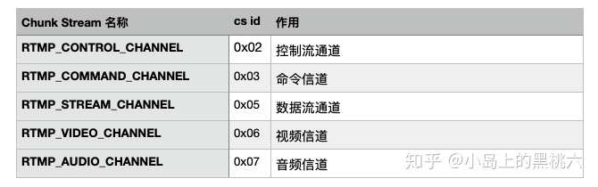
        2.  chunk type(fmt)的长度是固定的（占2位，注意单位是位，bit），Basic Header的长度取决于CSID的大小,在足够存储这两个字段的前提下最好用尽量少的字节从而减少由于引入Header增加的数据量。 


    2. MessageHeader 的长度有BasicHeader的chunktype(fmt)决定。  
        fmt&emsp;&emsp;&emsp;&emsp;&emsp;MessageHeader length  
        0------------------>11( timestamp(3byte)+ message len(3) + message type id(1) + msg stream id(4))  
        1------------------>7( timestamp delta(3byte)+ message len(3) + message type id(1) )  
        2------------------>3( timestamp delta(3byte) )  
        3------------------>0

        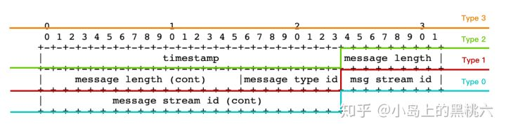

    3. Extended Timestamp：扩展时间戳。长度可以是0或4字节。**只有在timestamp或timestamp delta用3个字节表示放不下时才启用该字段。**
    4. Chunk Data（块数据）  
        用户层面上真正想要发送的与协议无关的数据，长度在(0,chunkSize]之间。**chunkSize默认值是128.**
        实际音视频数据及协议控制消息值都在 Chunk Data中。

# Chunk Data
3. 协议控制消息
   **在RTMP的chunk流会用一些特殊的值来代表协议的控制消息，它们的Message Stream ID必须为0（代表控制流信息），CSID必须为2，Message Type ID可以为1，2，3，5，6**，具体代表的消息会在下面依次说明。控制消息的接受端会忽略掉chunk中的时间戳，收到后立即生效。
   
   1. Set Chunk Size(Message Type ID=1) chunk Size的大小（不得小于128B）默认128B。通信双方各自维护一个chunksize。
        例如 Set Chunk Size消息的chunk的Data：
        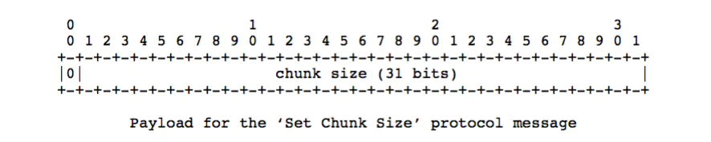
   2. Abort Message(Message Type ID=2)
        当一个Message被切分为多个chunk，接受端只接收到了部分chunk时，发送该控制消息表示发送端不再传输同Message的chunk，接受端接收到这个消息后要丢弃这些不完整的chunk。Data数据中只需要一个CSID，表示丢弃该CSID的所有已接收到的chunk。
        例如 Abort Message消息的chunk的Data：
        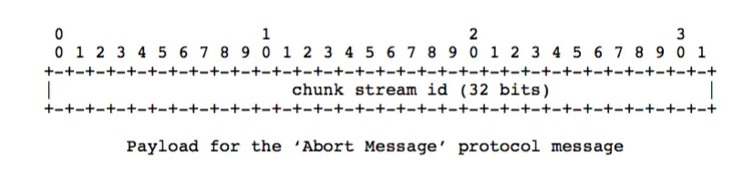
   3. Acknowledgement(Message Type ID=3)
        当收到对端的消息大小等于窗口大小（Window Size）时接受端要回馈一个ACK给发送端告知对方可以继续发送数据。
        例如 Acknowledgement的ChunkData
        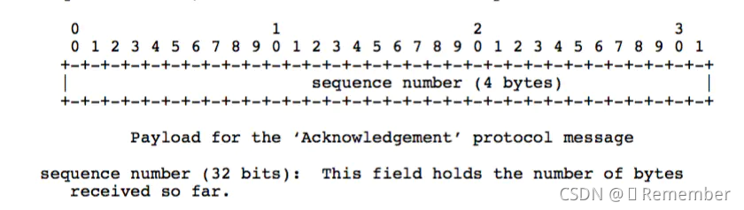
   4. Window Acknowledgement Size(Message Type ID=5)
        发送端在接收到接受端返回的两个ACK间最多可以发送的字节数。
        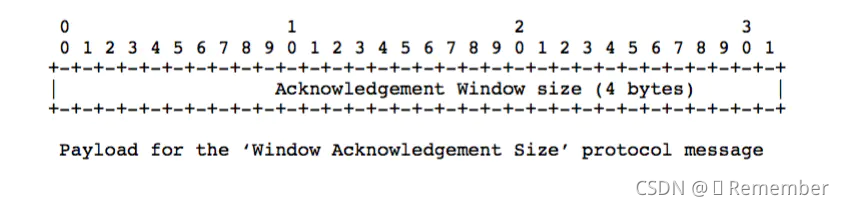
   5. Set Peer Bandwidth(Message Type ID=6)
        限制对端的输出带宽。接受端接收到该消息后会通过设置消息中的Window ACK Size来限制已发送但未接受到反馈的消息的大小来限制发送端的发送带宽。如果消息中的Window ACK Size与上一次发送给发送端的size不同的话要回馈一个Window Acknowledgement Size的控制消息。
        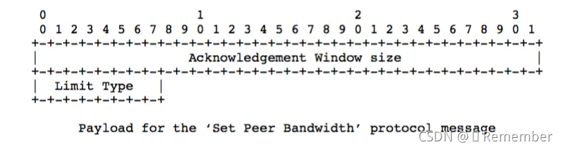
        - Hard(Limit Type＝0):接受端应该将Window Ack Size设置为消息中的值
        - Soft(Limit Type=1):接受端可以讲Window Ack Size设为消息中的值，也可以保存原来的值（前提是原来的Size小与该控制消息中的Window Ack Size）
        - Dynamic(Limit Type=2):如果上次的Set Peer Bandwidth消息中的Limit Type为0，本次也按Hard处理，否则忽略本消息，不去设置Window Ack Size。


# RTMP 的数据：可用消息类型

   1. 需要注意的是，消息往往都需要分块发送。消息的类型只是消息本身格式的设定，和分块传输的传输过程是不同的概念。理解上，应该把消息格式理解为消息的信息排列样式；把传输过程理解为物理上发送数据的方案。

   2. **RTMP 消息的头（RTMP Message Header，不是 Message Header，两个不是同一个东西）有自己的统一格式，当然这部分也是会被切割到 Chunk 里传输的。不过，因为实际意义和 Chunk Header 内容重复，实际的实现上也可以不需要考虑这个（得约定好）**。统一消息头样式如下：
    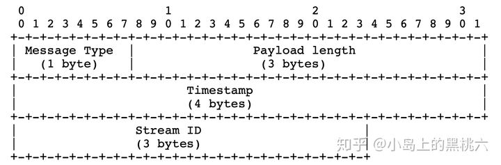


3. 不同类型的RTMP Message
   1. Command Message(命令消息，Message Type ID＝17或20)
   2. Data Message（数据消息，Message Type ID＝15或18）
   3. Shared Object Message(共享消息，Message Type ID＝16或19)
   4. Audio Message（音频信息，Message Type ID＝8）
   5. Video Message（视频信息，Message Type ID＝9）
   6. Aggregate Message (聚集信息，Message Type ID＝22)
   7. User Control Message Events(用户控制消息，Message Type ID=4)

    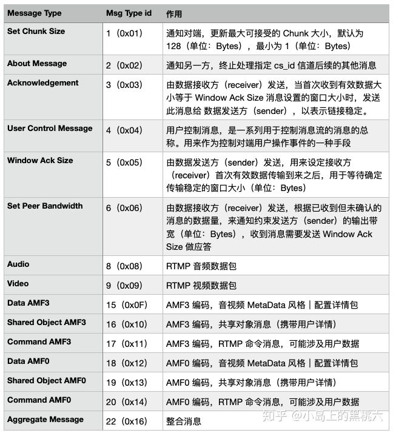


4. H264 在 RTMP 消息中是怎么携带 FLV 头的
 

    &emsp;&emsp;&emsp;&emsp;&emsp;&emsp;&emsp;&emsp;&emsp;&emsp;&emsp;&emsp;ChunkData  
    frameType(4bit)|CodecID(4bit)|AVCPacketType(8bit)|CompositonTime(24bit)|AVCDecoderConfigurateionRecord  
    ----------------------------------->flv video tag<--------------------------------------------------------------------- 


    &emsp;&emsp;&emsp;&emsp;&emsp;&emsp;&emsp;&emsp;&emsp;&emsp;&emsp;&emsp;ChunkData  
    frameType(4bit)|CodecID(4bit)|AVCPacketType(8bit)|CompositonTime(24bit)|NALUSize|NALU  
    ----------------------------------->flv video tag data<---------------------------->h264<----|							   

    1. FrameType 是 4 个 bit。取值 1：keyframe，2：inter frame
    2. CodecID 是 4 个 bit。取值 7，表示 AVC/H264
    3. AVCPacketType 是 8 个 bit。取值 0：表示 Composition Time 后面的数据是 AVCDecorderConfigurationRecord 结构，如图一所示；取值 1：表示 Composition Time 后面的数据是 H264 NALU 格式，如图二所示。
    4. Composition Time 是 24 个 bit。表示时间，暂且不用关注。


5. 协议控制消息

    RTMP 块流使用消息类型 ID 1、2、3、5、6 作为控制消息。这些消息包含了必要的 RTMP 块流协议信息  
    1. 设置块大小
    2. 中断消息
    3. 应答
    4. 应答窗口大小
    5. 设置流带宽

6. Command Message （17 或 20），使用AMF编码
    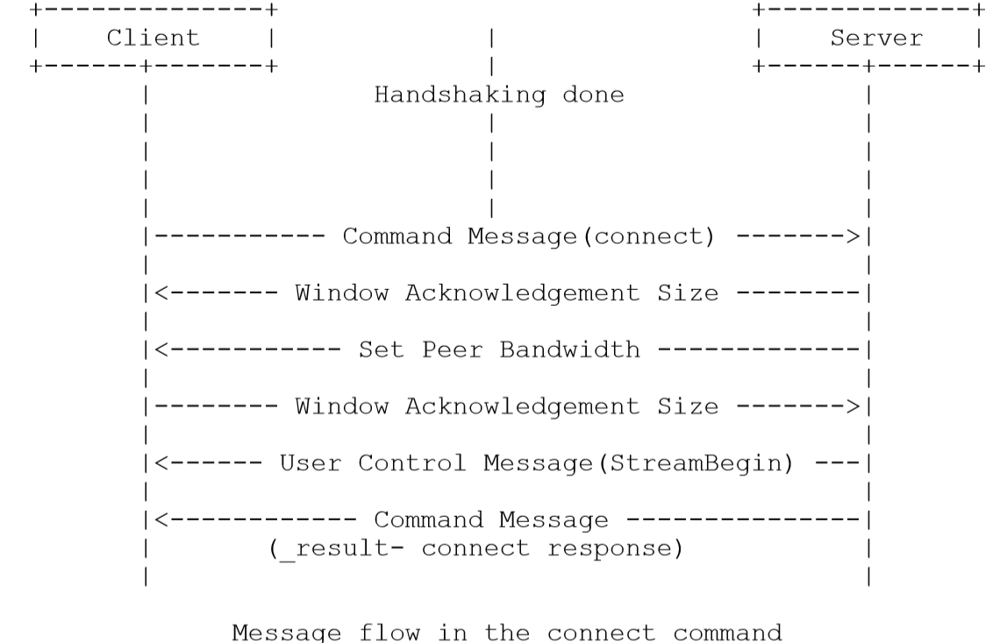
    1. 网络连接命令
        connect
        call
        close
        createStream
    
    1. 网络流命令
        play
        play2
        deleteStream
        closeStream
        receiveAudio
        receiveVideo
        publish
        seek
        pause

7. rtmp交互  
	    client	&emsp;&emsp;&emsp;&emsp;&emsp;&emsp;			server  
    1. 握手协议
    2.  connect协议
    3. createStream协议
    4. play协议
    5. 接收服务器消息，
       开始接受数据流
    6. stop播放器停止
   

        


    publish:

    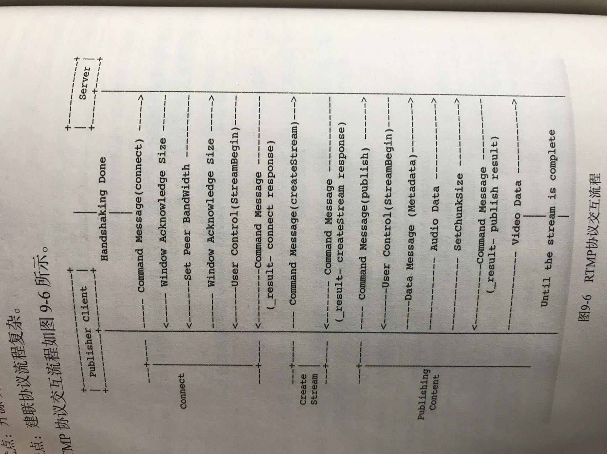    


```C++
enum eRtpPayloadType
{
    RTP_PAYLOAD_TYPE_PCMU    = 0,   // g711u
    RTP_PAYLOAD_TYPE_PCMA    = 8,   // g711a
    RTP_PAYLOAD_TYPE_JPEG    = 26,
    RTP_PAYLOAD_TYPE_H264    = 96,
    RTP_PAYLOAD_TYPE_H265    = 97,
    RTP_PAYLOAD_TYPE_OPUS    = 98,
    RTP_PAYLOAD_TYPE_AAC     = 99,
    RTP_PAYLOAD_TYPE_G726    = 100,
    RTP_PAYLOAD_TYPE_G726_16 = 101,
    RTP_PAYLOAD_TYPE_G726_24 = 102,
    RTP_PAYLOAD_TYPE_G726_32 = 103,
    RTP_PAYLOAD_TYPE_G726_40 = 104,
    RTP_PAYLOAD_TYPE_SPEEX   = 105,
};


class RtpPacket
{
public:
    //V(version)：2 bits，RTP的版本，这里统一为2
    int8_t version;
    //P(padding)：1 bit，如果置1，在packet的末尾被填充，填充有时是方便一些针对固定长度的算法的封装
    int8_t padding;
    //X(extension)：1 bit，如果置1，在RTP Header会跟着一个header extension
    int8_t extension;
    //CC(CSRC count): 4 bits，表示头部后 特约信源 的个数
    int8_t csrc_count;
    //M(marker): 1 bit，不同的有效载荷有不同的含义，marker=1; 对于视频，标记一帧的结束；对于音频，标记会话的开始。
    int8_t marker;
    //PT(playload type): 7 bits，表示所传输的多媒体的类型，
    int8_t playload_type;
    //sequence number: 16 bits，每个RTP packet的sequence number会自动加一，以便接收端检测丢包情况
    uint16_t sequence_number;
    //timestamp: 32 bits，时间戳
    uint32_t timestamp;
    //SSRC: 32 bits，同步源的id，每两个同步源的id不能相同
    uint32_t ssrc;
    //CSRC: CC指定，每个CSRC标识符占32位，可以有0～15个
    std::vector<uint32_t> csrc;

public:
    RtpPacket(uint32_t ssrc_val);
    virtual ~RtpPacket();

    /**
     *  rtp 打包 g711a方法: | 12bytes RTP头 | G711 负载 |
     * @param[in][out]  payload  输入的负载数据，添加rtp头后返回
     * @param[in][out]  len      输入的负载数据长度，添加rtp头后返回新的长度
     */
    void packet_g711a(uint8_t* payload, int& len);

};
```