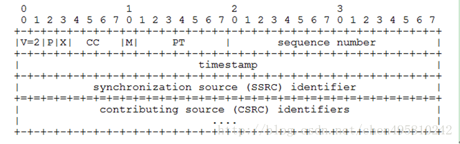
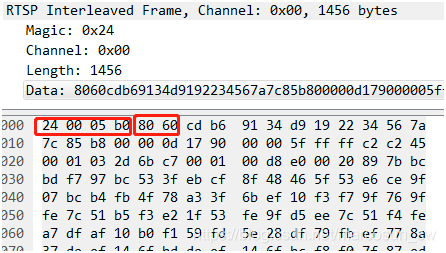
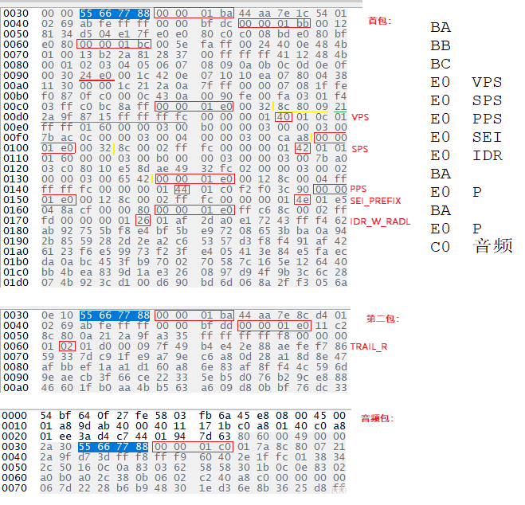
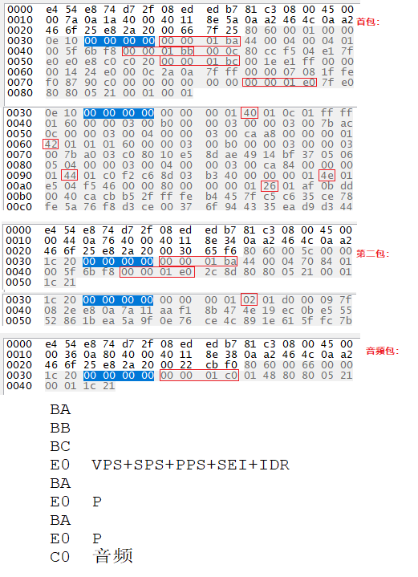
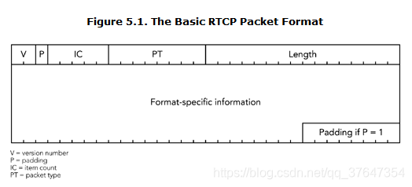
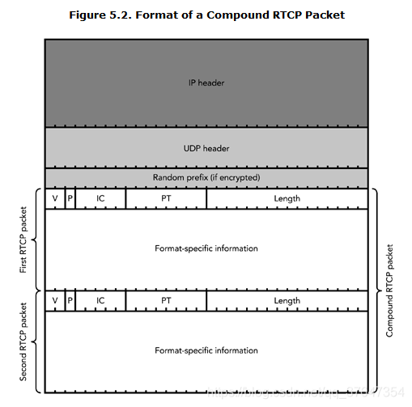

<style>
strong {
    color:#00F9A5;
    size: 100px;
    margin: 0em;
    font-size: large;
    font-style: italic;
}
</style>

# RTP

1. rtp 字段介绍  (**重点看**)  
   哪个字段代表流类型(https://blog.csdn.net/chen495810242/article/details/39207305、https://blog.yasking.org/a/hikvision-rtp-ps-stream-parser.html、http://www.javashuo.com/article/p-unskfboj-eg.html)
    1. RTP Header 解析 **（12字节）**
        
        

        1. V: RTP协议版本号，占**2**位。当前协议版本号为2.
        2. P: 填充标志位,,,&emsp;&emsp;占**1**位。如果P=1，则在该报文尾部填充一个或多个额外的八位组，它们不是有效载荷的一部分。
        3. X: 扩展标志位,,,&emsp;&emsp;占**1**位。如果X=1，则在RTP报头后跟一个扩展头
        4. CC：CSRC计数器,，占**4**位。
        5. M: 标记，占1位。不同的载荷不同的含义。对于视频，标记一帧的结束;对于音频，标记会话的开始。
        6. PT：有效载荷类型，占**7**位。用于说明RTP报文重有效的载荷类型。在流媒体中大部分是用来区分音频流和视频流的，这样便于客户端进行解析。
        7. **序列号，占16位。**
        8. **时间戳，占32位。**
        9. 同步信源标识符：占32位。
        10. 特约信源标识符：占32位。
        11. ***注：基本的RTP说明并不定义任何头扩展本身，如果遇到X=1，需要特殊处理。***

    2. rtp抓包  
        一般情况下：扩展标志x=0,故其头长度为12个字节，因此第一个字节常为0x80。  
        第二个字节，如果为视频，PT常为96（0x60),如是开始帧，此值为0xe0,否则为0x60.  
        - 在RTP基于TCP传输中：  包格式为：RTP标志+RTP头+RTP负载数据  
        - 在RTP基于UDP传输中，无RTP标志。  
        其中：**RTP标志位（4个字节）：$+channel id(1 byte)+长度（2字节)此长度不包含本身这4个字节。**  
        如下图1：是一个SPS,其长度为16， 16+12=28=0x1c , RTP头的第一字节为0x80，第2个字节为0xe0  
          

        0x05b0=1456=1500-20-20-4  
        RTP包最大长度： 　tcp: 1500-20(ip头）-20（tcp头）-4（RTP标志）= 1456
                         UDP: 1500-20(ip头）-8(udp头）=1472

        对于一个原始的 H.264 NALU 单元常由 [Start Code] [NALU Header] [NALU Payload] 三部分组成, 其中 Start Code 用于标示这是一个 NALU 单元的开始, 必须是 “00 00 00 01” 或 “00 00 01”, NALU 头仅一个字节, 其后都是 NALU 单元内容.  
        打包时去除 “00 00 01” 或 “00 00 00 01” 的开始码, 把其他数据封包的 RTP 包即可.  
        H264的RTP中有三种不同的基本负载（Single NAL,Non-interleaved,Interleaved)  
        通常在SDP 参数中指定。
        如:  
        m=video 49170 RTP/AVP 98  
        a=rtpmap:98 H264/90000  
        a=fmtp:98 profile-level-id=42A01E; packetization-mode=1; sprop-parameter-sets=Z0IACpZTBYmI,aMljiA==

    3. **rtp可以载荷h264裸码流和ps流**。
        1. rtp载荷h264裸码流。荷载格式定义三个不同的基本荷载结构，接收者可以通过RTP荷载的第一个字节后5位（如图2）识别荷载结构。
           - 单个NAL单元包：荷载中只包含一个NAL单元。NAL头类型域等于原始 NAL单元类型,即在范围1到23之间
           - 聚合包：本类型用于聚合多个NAL单元到单个RTP荷载中。本包有四种版本,单时间聚合包类型A (STAP-A)，单时间聚合包类型B (STAP-B)，多时间聚合包类型(MTAP)16位位移(MTAP16), 多时间聚合包类型(MTAP)24位位移(MTAP24)。赋予STAP-A, STAP-B, MTAP16, MTAP24的NAL单元类型号分别是 24,25, 26, 27
           - 分片单元：用于分片单个NAL单元到多个RTP包。现存两个版本FU-A，FU-B,用NAL单元类型 28，29标识 
        2. rtp载荷ps流(https://blog.csdn.net/zhangrui_fslib_org/article/details/119428645)
           - ps封装h265
           - 海康抓包：

                

           - 大华抓包：

             


# RTCP
RTCP的封装：
RTP规范中定义了五种类型的RTCP数据包：接收者报告（RR），发送者报告（SR），源描述（SDES），离开申明（BYE）和特殊应用包（APP）。 它们都遵循一个共同的结构，如下图5.1所示：



- 版本号(V):
    作用：标识使用的RTP版本，当前版本为2，版本号字段的唯一有意义的用途是作为数据包有效性检查的一部分。
    字段丢失带来的影响：丢失意味着机器无法判断该数据包是否有效，丢弃。

- 填充位(P):
    作用：该位置1，则该RTP包尾部添加填充字节，填充很少使用，但是对于某些使用特定块大小的加密方案，以及使有效载荷格式适应固定容量信道，需要填充。
    字段丢失带来的影响：填充部分失去作用，加密失效，有效载荷格式与信道不匹配。

- 项目数IC：
    作用：某些数据包类型包含项目列表，可能除了某些固定的类型特定信息之外。这些数据包类型使用项目计数字段来指示数据包中包含的项目数（该字段根据其用途在不同的数据包类型中具有不同的名称）。每个RTCP分组中可以包括多达31个项目，也受到网络的最大传输单元的限制。如果需要超过31个项目，则应用程序必须生成多个RTCP数据包。项目计数为零表示项目列表为空（这并不一定意味着数据包为空）。不需要项目计数的数据包类型可以将此字段用于其他目的。
    字段丢失带来的影响：该字段丢失依据其所在的数据包类型判断，可以确定该字段功能丧失。

- 载荷类型(PT):
    作用：标识RTP载荷的类型，接收应用程序检查有效负载类型以确定如何处理数据。
    字段丢失带来的影响：很明显当该字段丢失，接收端将无法解码该RTP包，该RTP包将被丢弃

- 长度：
    作用：长度字段表示公共报头之后的分组内容的长度。它以32位字为单位进行测量，因为所有RTCP数据包的长度都是32位的倍数，因此计数八位字节只会出现不一致的可能性。零是有效长度，表示该数据包仅包含四个八位字节的标头（在这种情况下，IC标头字段也将为零）。
    字段丢失带来的影响：RTCP数据包长度未知，如果该字段作为参数使用，则相应功能丧失。（不过我觉的在读取数据的时候也可以计算出长度，就是有点浪费时间）
 
RTCP数据包永远不会单独传输; 相反，它们总是组合在一起进行传输，形成复合数据包。 每个复合数据包都封装在单个较低层数据包中 - 通常是UDP / IP数据包 - 用于传输。 如果要加密复合数2.据包，则RTCP数据包组的前缀为32位随机值。复合数据包结构如下图5.2所示：




```C++
enum eRtpPayloadType
{
    RTP_PAYLOAD_TYPE_PCMU    = 0,   // g711u
    RTP_PAYLOAD_TYPE_PCMA    = 8,   // g711a
    RTP_PAYLOAD_TYPE_JPEG    = 26,
    RTP_PAYLOAD_TYPE_H264    = 96,
    RTP_PAYLOAD_TYPE_H265    = 97,
    RTP_PAYLOAD_TYPE_OPUS    = 98,
    RTP_PAYLOAD_TYPE_AAC     = 99,
    RTP_PAYLOAD_TYPE_G726    = 100,
    RTP_PAYLOAD_TYPE_G726_16 = 101,
    RTP_PAYLOAD_TYPE_G726_24 = 102,
    RTP_PAYLOAD_TYPE_G726_32 = 103,
    RTP_PAYLOAD_TYPE_G726_40 = 104,
    RTP_PAYLOAD_TYPE_SPEEX   = 105,
};


class RtpPacket
{
public:
    //V(version)：2 bits，RTP的版本，这里统一为2
    int8_t version;
    //P(padding)：1 bit，如果置1，在packet的末尾被填充，填充有时是方便一些针对固定长度的算法的封装
    int8_t padding;
    //X(extension)：1 bit，如果置1，在RTP Header会跟着一个header extension
    int8_t extension;
    //CC(CSRC count): 4 bits，表示头部后 特约信源 的个数
    int8_t csrc_count;
    //M(marker): 1 bit，不同的有效载荷有不同的含义，marker=1; 对于视频，标记一帧的结束；对于音频，标记会话的开始。
    int8_t marker;
    //PT(playload type): 7 bits，表示所传输的多媒体的类型，
    int8_t playload_type;
    //sequence number: 16 bits，每个RTP packet的sequence number会自动加一，以便接收端检测丢包情况
    uint16_t sequence_number;
    //timestamp: 32 bits，时间戳
    uint32_t timestamp;
    //SSRC: 32 bits，同步源的id，每两个同步源的id不能相同
    uint32_t ssrc;
    //CSRC: CC指定，每个CSRC标识符占32位，可以有0～15个
    std::vector<uint32_t> csrc;

public:
    RtpPacket(uint32_t ssrc_val);
    virtual ~RtpPacket();

    /**
     *  rtp 打包 g711a方法: | 12bytes RTP头 | G711 负载 |
     * @param[in][out]  payload  输入的负载数据，添加rtp头后返回
     * @param[in][out]  len      输入的负载数据长度，添加rtp头后返回新的长度
     */
    void packet_g711a(uint8_t* payload, int& len);

};
```