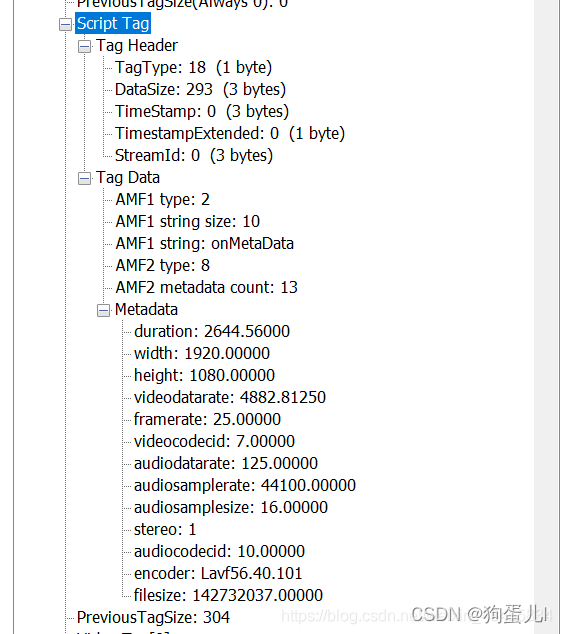

# FLV
见http-flv.md  
https://blog.csdn.net/IOT_SHUN/article/details/79759771

# HTTP-FLV

flv 消息结构 参考：https://blog.csdn.net/zranxi/article/details/122866828

## Flv文件格式
Flv由文件头（File Header）和 文件体（File Body）组成。

Flv Body由一系列的Tag组成，每个Tag又有一个preTagSize字段，标记着前面一个Tag的大小。

## Flv Header 
文件头由一下几部分组成：

Signature(3 Byte)+Version(1 Byte)+Flags(1 Bypte)+DataOffset(4 Byte)

1. Signature **占3个字节**：固定FLV三个字符作为标示。一般发现前三个字符为FLV时就认为他是flv文件。
2. Version **占1个字节**：标示FLV的版本号。这里我们看到是1
3. Flags **占1个字节**：内容标示。第0位和第2位,分别表示 video 与 audio 存在的情况.(1表示存在,0表示不存在)。看到0x05，也就是0x00000101，代表既有视频，也有音频。
4. DataOffset **占4个字节**：表示FLV的header长度。**固定9个字节**

## Flv Body
Flv Body由一个一个Tag组成，每个Tag都有一个preTagSize字段，标记着前面一个Tag的大小。

Tag有三种类型，Audio Tag（音频Tag），Video Tag（视频Tag），script Tag（又称Metadata Tag）

每个Tag由“Tag Header”和“Tag Data”组成，对于不同类型的Tag，**“Tag Header”的格式都是相同的，都是11个字节**，“Tag Body”的格式就不一样了。  

## flv 概览

**一般一个flv文件由一个头部信息，一个script Tag，以及若干个video Tag和audio Tag组成。**

## Tag Data
Flv有三种tag：“Audio Tag Data”、“Video Tag Data”、“Script Tag Data”  

  
- Video Tag Data
  

### Audio Tag Data

Audio tag是由tag Header + Tag Data组成：

tag Header：
- TagType: 8 (1 byte)  
- TagType 代表含义如下：  
  - 8: audio  
  - 9 : video  
  - 18 : script data  
- DataSize: 7 (3 bytes)  
  - tag Data大小  
  - tag Header大小 = Previous Tag Size - DataSize = 18 - 7 = 11 
- TimeStamp: 0 (3 bytes) 时间戳  
- TimestampExtended: 0 (1 byte) 扩展时间戳  
- StreamId: 0 (3 bytes) 流ID

### Audio Tag Data 结构图
  
**FLV封装格式并不支持48KHz的采样率。**  

- Audio Tag Data 的第一个字节由
    - **SoundFormat(4bit)**   
    - **SoundRate(2bit)**  
    - **SoundSize(1bit)**  
    - **SoundType(1bit)**

### Video Tag Data

tag Header：

- TagType: 9 (1 byte)  
- TagType 代表含义如下：  
    - 8: audio  
    - 9 : video  
    - 18 : script data  
- DataSize: 50 (3 bytes)
- tag Data大小
- tag Header大小 = Previous Tag Size - DataSize
- TimeStamp: 0 (3 bytes) 时间戳  
- TimestampExtended: 0 (1 byte) 扩展时间戳  
- StreamId: 0 (3 bytes) 流ID

### Video Tag Data结构图
  
**FrameType 1:keyframe 2:interframe**  
**CodecID  OXO7:AVC, 0x0E:HEVC**

#### AVCVideoPacket格式
AVCVideoPacket同样包括Packet Header和Packet Body两部分：   
即AVCVideoPacket Format：   
**| AVCPacketType(8)| CompostionTime(24) | Data |**   
- AVCPacketType为包的类型：   
  - 如果AVCPacketType=0x00，为AVCSequence Header； 
  - 如果AVCPacketType=0x01，为AVC NALU； 
  - 如果AVCPacketType=0x02，为AVC end of sequence   
- CompositionTime为相对时间戳： 
  - 如果AVCPacketType=0x01， 为相对时间戳； 
  - 其它，均为0；   
- Data为负载数据： 
  - 如果AVCPacketType=0x00，为AVCDecorderConfigurationRecord； 
  - 如果AVCPacketType=0x01，为NALUs； 
  - 如果AVCPacketType=0x02，为空。 

- AVCDecorderConfigurationRecord格式
AVCDecorderConfigurationRecord包括文件的信息。   
具体格式如下,单位bit：   
| cfgVersion(8) | avcProfile(8) | profileCompatibility(8) |avcLevel(8) | reserved(6) | lengthSizeMinusOne(2) | reserved(3) | numOfSPS(5) |spsLength(16) | sps(n) | numOfPPS(8) | ppsLength(16) | pps(n) |

    

### scripts tag 解析
  
该类型Tag又通常被称为MetadataTag，会放一些关于FLV视频和音频的元数据信息如：duration、width、height等。通常该类型Tag会跟在FileHeader后面作为第一个Tag出现，而且只有一个。  

tag Header：
- TagType: 18 (1 byte)  
- TagType 代表含义如下：  
    - 8: audio  
    - 9 : video  
    - 18 : script data  
- DataSize: 293 (3 bytes)  
    - tag Data大小  
    - tag Header大小 = Previous Tag Size - DataSize  
- TimeStamp: 0 (3 bytes) 时间戳  
- TimestampExtended: 0 (1 byte) 扩展时间戳  
- StreamId: 0 (3 bytes) 流ID  

### script tag Data：
AMF包：第一个字节表示AMF包的类型

  

**AMF编码一般为类型、长度、内容**  
第一个AMF包：
第一个字节一般为0x02，表示字符串，第2-3个字节表示字符串的长度，一般为0x000A，后面跟的就是字符串，一般为"onMetaData"。

第二AMF包：
第一个字节为0x08，表示数组，第2-5个字节表示数组元素个数，后面跟着就是数组的元素，**格式为：元素名长度（UI16） + 元素名（UI8[n]） + 元素的值(double)，最后以“009”结尾**。

