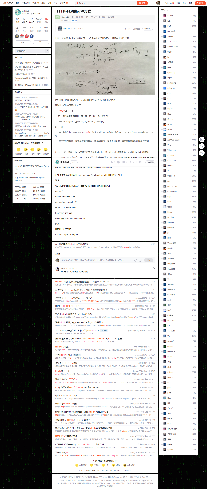

# http-flv
https://blog.csdn.net/ai2000ai/article/details/80306735

1. HTTP-FLV 即将流媒体数据封装成 FLV 格式，然后通过 HTTP 协议传输给客户端。
2. HTTP协议中有个约定：content-length字段，http的body部分的长度服务器回复http请求的时候如果有这个字段，客户端就接收这个长度的数据然后就认为数据传输完成了，如果服务器回复http请求中没有这个字段，客户端就一直接收数据，直到服务器跟客户端的socket连接断开。
3. http-flv直播就是利用第二个原理，服务器回复客户端请求的时候不加content-length字段，在回复了http内容之后，紧接着发送flv数据，客户端就一直接收数据了。

### 延迟分析
**理论上（除去网络延迟外），FLV 可以做到仅仅一个音视频 tag 的延迟。**  
相比 RTMP 的优点：
- 可以在一定程度上避免防火墙的干扰 （例如, 有的机房只允许 80 端口通过）；
- 可以很好的兼容 HTTP 302 跳转，做到灵活调度；
- 可以使用 HTTPS 做加密通道；
- 很好的支持移动端（Android，IOS）；