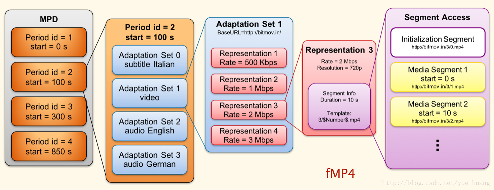

# DASH

为什么选择DASH  
YouTube采用DASH！其网页端及移动端APP都使用了DASH。DASH的其他采用者包括：Netflix, Hulu, …

## 什么是DASH  
一种服务端、客户端的流媒体解决方案：  
服务端：  
将视频内容分割为一个个分片，每个分片可以存在不同的编码形式（不同的codec、profile、分辨率、码率等）；  
播放器端：  
就可以根据自由选择需要播放的媒体分片；可以实现adaptive bitrate streaming技术。不同画质内容无缝切换，提供更好的播放体验。

## DASH中的重要概念  
- MPD  
媒体文件的描述文件（manifest），作用类似HLS的m3u8文件。MPD文件以XML格式组织，其层次结构参图1。  

- Representation  
对应一个可选择的输出（alternative）。如，480p video，720p video, 44100采样 audio，22050采样audio，都使用Representation描述。  

- Segment（分片）  
每个Representation会划分为多个Segment。Segment分为4类，其中，最重要的是：Initialization Segment（每个Representation都包含1个Init Seg），Media Segment（每个Representation的媒体内容包含若干Media Seg）！

## fMP4
fMP4（fragmented MP4），可以简单理解为分片化的MP4，是DASH采用的媒体文件格式，文件扩展名通常为（.m4s或直接用.mp4）。

1. 普通MP4 由索引文件头文件moov box和媒体数据mdat box组成。
2. fMP4 由分片组成，可以按整个文件存储，也可以按分片存储：
    - 如果按照单个文件存储，每个输出是一个m4s文件。 完整的fMP4视频可以描述为如下形式：
    moov + (moof + mdat) * N
    其中moof box是分片（fragment）的标识， mdat box存放的是当前分片的媒体数据；
   - 如果按照分片存储，每个分片是一个m4s文件，输出对应了多个m4s。

3. fMP4中的第一个分片，对应了DASH协议中Initialization Segment；其后的分片，则对应Media Segment。

## YouTube调研
一段15’ 720分辨率视频，YouTube有如下Representation:
1. audio1 id:139 codec:HE-AAC 采样率22050 分片:5
2. audio2 id:140 codec:AAC-LC 采样率44100 分片:5
3. video1 id:133 codec:264 main profile level1.2 240p 分片:4
4. video2 id:134 codec:264 main profile level2.0 360p 分片:4
5. video3 id:135 codec:264 main profile level2.0 480p 分片:4
6. video4 id:160 codec:264 main profile level1.1 144p 分片:4
7. video5 id:136 codec:264 main profile level3.0 720p 分片:4

关注视频部分，4个分片包含：1个Init Seg，3个Media Seg，视频内容部分分别为5.12s 5.12s 4.76s。

- 下载MPD
- 下载Init Seg
- 下载Media Seg（s）
    在第6s已经完成所有视频分片的下载。

切换行为  

切换前，Representation 0的所有分片已经下载完成，交互流程同上，
第8s进行画质切换：
1. 下载Representation 1的Init Seg # 每次切换都会先下载Init Seg
2. 下载Representation 1 当前所在分片！Seg2
3. 下载后续分片。

说明：YouTube在播放Rep0 Seg2期间发生切换，会下载Repr1的Seg2，这属于YouTube的播放策略。很多DASH播放器，此时会直接请求Repr1的Seg3。
