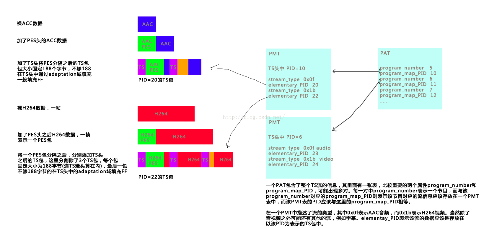

# HLS流
本文用个实际例子，简单说明HLS视频直播过程中，客户端与服务器之间的交互流程。
假设在web服务器里， 有个m3u8文件，文件名为playlist.m3u8，文件内容如下：

#EXTM3U  
#EXT-X-TARGETDURATION:5  
#EXT-X-MEDIA-SEQUENCE:1400  
#EXTINF:4,  
segmenter-1400.ts  
#EXTINF:4,  
segmenter-1401.ts  

那么， 客户端请求直播流程如下：
1. 首先是客户端发出一个GET请求， GET /apple_media_dir/2/playlist.m3u8 HTTP/1.1。
2. 服务器响应 GET playlist.m3u8的请求， 将playlist.m3u8文件以application/octet-stream类型发送出去。
3. 客户端 GET segmenter-1400.ts。
4. 服务器响应 GET segmenter-1400.ts的请求， 发送segmenter-1400.ts文件。
5. 客户端 GET segmenter-1401.ts。
6. 服务器响应 GET segmenter-1401.ts的请求， 发送segmenter-1401.ts文件。

当服务器接收完segmenter-1401.ts后， 又重新请求playlist.m3u8，而已此时的playlist.m3u8是已经被更新过的，可能内容如下：

#EXTM3U  
#EXT-X-TARGETDURATION:5  
#EXT-X-MEDIA-SEQUENCE:1402  
#EXTINF:4,  
segmenter-1402.ts  
#EXTINF:4,  
segmenter-1403.ts  
 

 # TS Packet
 

 

 # TS单一码流、混合码流
    单一性：TS流的基本组成单位是长度为188字节的TS包。
    混合性： TS流由多种数据组合而成，一个TS包中的数据可以是视频数据，音频数据，填充数据，PSI/SI表格数据等（唯一的PID对应）

# 仔细看这篇文章  
    https://blog.csdn.net/leek5533/article/details/104993932/
    https://blog.csdn.net/heibao111728/article/details/80308475

