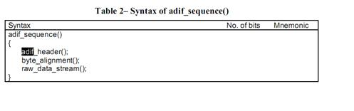
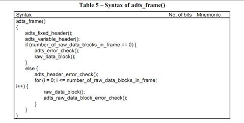
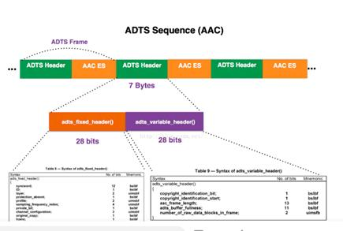
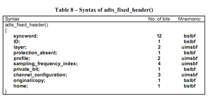
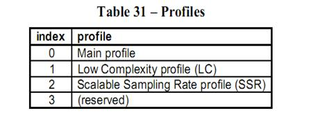
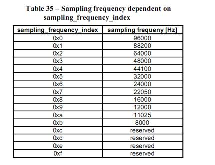
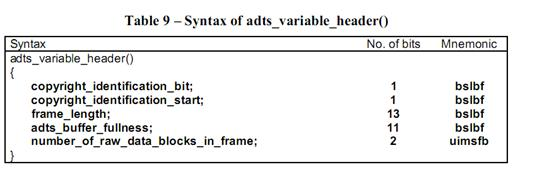
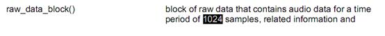

# AAC (https://www.jianshu.com/p/aa3b28262a7f )
aac 音频 48k fltp(面试官说的flip，应该是说错了) 双通道 数据大小 格式大小
   -  帧大小计算：
   - 标准AAC采集的PCM16LE原始音频数据，
   - 每一帧有1024个采样样本sample，
   - 每个采样样本包括左声道2个字节（采样的位数为16位,fltp为32位，参考第一个链接）和右声道2个字节，
   - 即一帧大小为4096 bytes。
   - 采样频率为48000HZ，即1秒采集 48000次样本， 所以1秒内有接近48000/1024 = 46帧。一般经过AAC编码压缩后，码率配置为128Kbps，原始音频数据流码率 = 取样频率×采集位数×声道数 = 48000 * 16 * 2 = 1536K。

AV_SAMPLE_FMT_FLTP  float, planar
AV_SAMPLE_FMT_DBLP 	double, planar

# AAC：(通常采样率48000Hz)
   即MPEG-2 Advanced Audio Coding，分为流格式和文件格式。文件格式主要用于文件存储和文件播放，流格式主要用于流媒体在线播放。

# 文件格式：adif格式
该格式特点：只有开头有一个头部信息，后面都是AAC裸数据。适应磁盘存储和文件播放

adif_header 介绍。

# 流格式：adts_frame格式
该格式特点：**每一帧数据=固定头(fixed_header)+ 可变头(variable_header)+帧数据(raw_data)**，适合流媒体在线播放。

## adts_fixed_header  (长度28bits)
   

- syncword 同步字The bit string ‘1111 1111 1111’，说明一个ADTS帧的开始。

- ID MPEG 标示符, 设置为1.

- layer Indicates which layer is used. Set to ‘00’

- protection_absent 表示是否误码校验

- profile 表示使用哪个级别的AAC，如01 Low Complexity(LC)--- AACLC  
  

   - HE其实就是AAC（LC）+SBR技术，SBR其实代表的是Spectral Band Replication(频段复制)
   - HEv2就是AAC（LC）+SBR+PS技术。PS指“parametric stereo”（参数立体声）

- sampling_frequency_index 表示使用的采样率下标  
  

- channel_configuration 表示声道数

- frame_length 一个ADTS帧的长度包括ADTS头和raw data block.

## adts_variable_header（长度28bits)

- adts_buffer_fullness 0x7FF 说明是码率可变的码流
- number_of_raw_data_blocks_in_frame 表示ADTS帧中有number_of_raw_data_blocks_in_frame + 1个AAC原始帧.
所以说number_of_raw_data_blocks_in_frame == 0 表示说ADTS帧中有一个AAC数据块并不是说没有。

- 其他字段为定义，可以忽略。

## raw数据块(1024个采样)

- 一个帧包含1024个采样
- Duration算法：
一个AAC原始帧包含一段时间内1024个采样及相关数据。
一个AAC音频帧的播放时间=一个AAC帧对应的采样样本的个数/采样率。  
总时间t=总帧数x一个AAC音频帧的播放时间  
