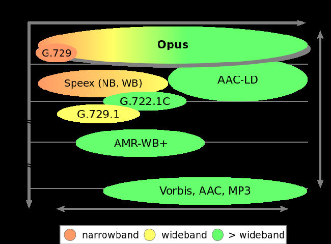

# OPUS

Opus 是一个完全开源，免费的，通用性高的音频解码器。Opus 在网络上有着无与伦比的交互式语音和音乐传播功能，但也可以用来存储，在流媒体上使用。Opus 遵从 Internet Engineering Task Force (IETF)  RFC 6716 标准，整合了 Skype's SILK 解码和 Xiph.Org's CELT 解码的技术。

Opus 可以处理很大范围的音频应用，包括网络电话，游戏语音聊天室，视频会议，甚至是远程在线音乐会。它可以把低码率窄带语音变成高质量的立体语音。

支持的特性：

- 比特率范围（6 kb/s-510 kb/s）

- 采样率从 8 kHz (窄带)  到 48 kHz (全带宽)

- 帧大小从 2.5 ms 到  60 ms

- 支持 constant bit-rate (CBR) 和 variable bit-rate (VBR)

- 音频带宽可以从窄带到全带宽

- 支持语音和音乐

- 支持单声道和立体声

- 支持多达 255 个频道（multistream frames）

- 可动态调节比特率，带宽大小和帧大小

- 良好的 loss robustness 和 packet loss concealment (PLC)

- 实现浮点和定点