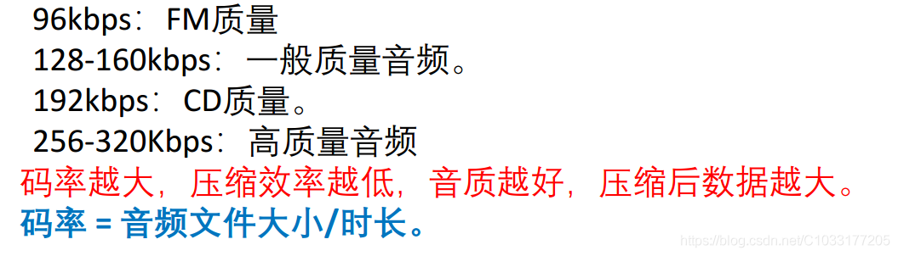
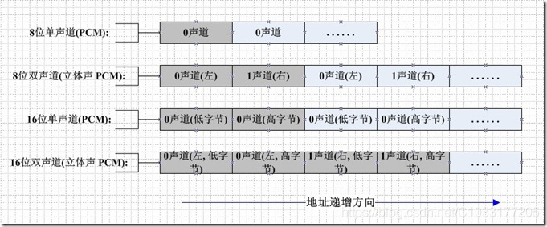
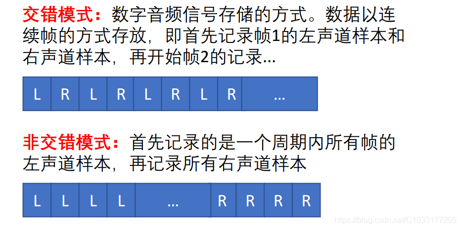
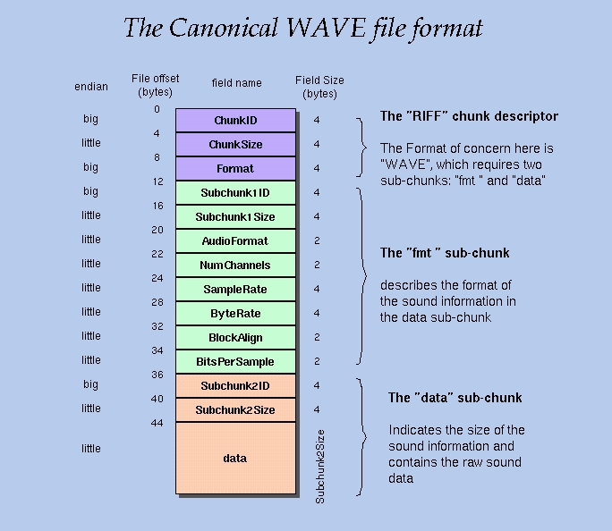
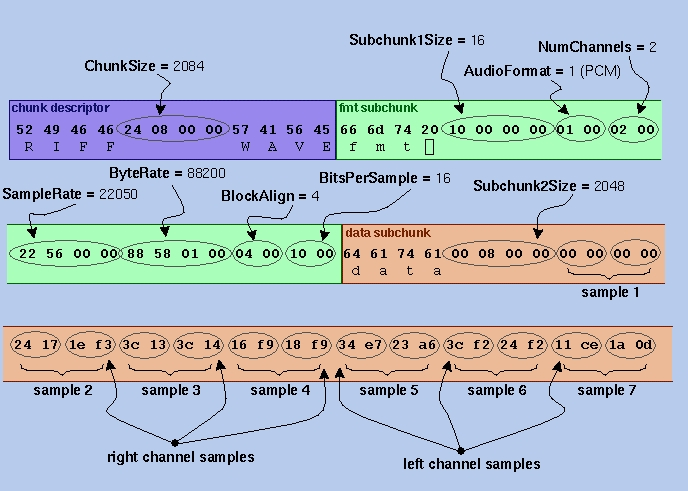

# pcm

1. pcm格式有哪些
   
## PCM数据常用量化指标
- 采样率(Sample rate)：每秒钟采样多少次，以Hz为单位。详见：**采样率(Sample rate)**一节。
- 位深度(Bit-depth)：表示用多少个二进制位来描述采样数据，一般为16bit。详见：**Quantization(量化)**一节。
- 字节序：表示音频PCM数据存储的字节序是大端存储（big-endian）还是小端存储（little-endian），为了数据处理效率的高效，通常为小端存储。
- 声道数（channel number）：当前PCM文件中包含的声道数，是单声道（mono）、双声道（stereo）？此外还有5.1声道等。
- 声道布局：立体声，低音炮（2.1声道），5.1环绕立体声
- 采样数据是否有符号（Sign）：要表达的就是字面上的意思，需要注意的是，使用有符号的采样数据不能用无符号的方式播放。以FFmpeg中常见的PCM数据格式s16le为例：它描述的是有符号16位小端PCM数据。s表示有符号，16表示位深，le表示小端存储。
- 比特率：没有压缩的音频数据的比特率 = 采样频率 * 采样精度 * 通道数。
- 码率：压缩后的音频数据的比特率，常见的码率有：
  
- 帧：音频的帧的概念没有视频帧那么清晰，几乎所有视频编码格式都可以简单的认为一帧就是编码后的一张图像。
    - 帧长：
    - （1）可以指每帧采样数播放的时间，mp3 48K，1152个采样点，每帧则为24ms；aac则是每帧是1024个采样点。攒够一帧的数据才送去做编码。
    （2）也可以指压缩后每帧的数据长度，所以需要注意。
    - 每帧持续时间（秒）=每帧采样点数/采样频率（hz）

## PCM 数据流

如果是单声道的音频文件，采样数据按时间的先后顺序依次存入（有的时候也会采用LRLRLR方式存储，只是另一个声道的数据为0），如果是双声道的话就按照LRLRLR的方式存储，存储的时候还和机器的大小端有关。大端模式如下图所示：



存储方式可能还有交错和非交错的方式：


一般我们描述PCM音频数据的参数的时候有如下描述方式
```
44100HZ 16bit stereo: 每秒钟有 44100 次采样, 采样数据用 16 位(2字节)记录, 双声道(立体声);
22050HZ 8bit  mono: 每秒钟有 22050 次采样, 采样数据用 8 位(1字节)记录, 单声道;
```
## 音量控制
音量的表示实际上就是量化过程中每个采样数据的level值，只要适当的增大或者缩小采样的level就可以达到更改音量的目的。
但需要说明的是，并是不将level值*2就能得到两倍于原声音的音量。

因为如下两个原因：

- 数据溢出：我们都知道每个采样数据的取值范围是有限制的，例如一个signed 8-bit样本，取值范围为-128～128，值为125时，放大两倍后的值为250，超过了可描述的范围，此时发生了数据溢出。这个时候就需要我们做策略性的裁剪处理，使放大后的值符合当前格式的取值区间。
- 对数描述：
平时表示声音强度我们都是用分贝（db）作单位的，声学领域中，分贝的定义是声源功率与基准声功率比值的对数乘以10的数值。根据人耳的心理声学模型，人耳对声音感知程度是对数关系，而不是线性关系。人类的听觉反应是基于声音的相对变化而非绝对的变化。对数标度正好能模仿人类耳朵对声音的反应。所以用分贝作单位描述声音强度更符合人类对声音强度的感知。前面我们直接将声音乘以某个值，也就是线性调节，调节音量时会感觉到刚开始音量变化很快，后面调的话好像都没啥变化，使用对数关系调节音量的话声音听起来就会均匀增大。

## WAV
WAV为微软公司（Microsoft)开发的一种声音文件格式，它符合RIFF(Resource Interchange File Format)文件规范，用于保存Windows平台的音频信息资源，被Windows平台及其应用程序所广泛支持。WAVE文件通常只是一个具有单个“WAVE”块的RIFF文件，该块由两个子块（”fmt”子数据块和”data”子数据块），它的格式如下图所示


比如下面的例子

这里是一个WAVE文件的开头72字节，字节显示为十六进制数字： 
52 49 46 46 24 08 00 00 57 41 56 45 66 6d 74 20 10 00 00 00 01 00 02 00 
22 56 00 00 88 58 01 00 04 00 10 00 64 61 74 61 00 08 00 00 00 00 00 00 
24 17 1e f3 3c 13 3c 14 16 f9 18 f9 34 e7 23 a6 3c f2 24 f2 11 ce 1a 0d 
字段解析：  

