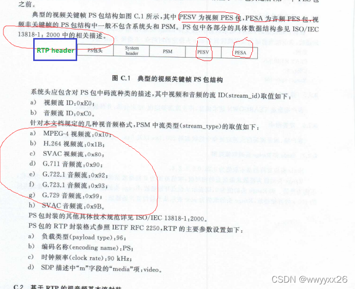
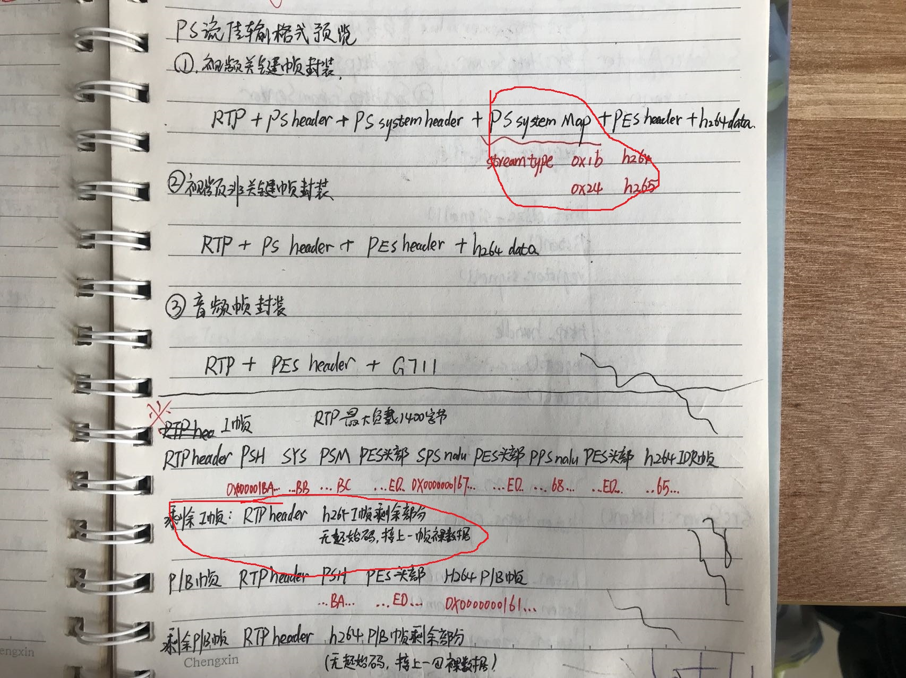
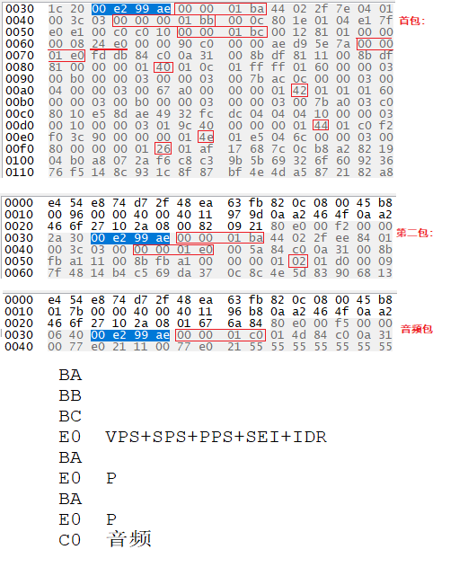

# PS流 Program Stream
(
https://blog.csdn.net/fanyun_01/article/details/120537670、  
https://blog.csdn.net/heibao111728/article/details/80308475
)
  
0x 00 00 01 ba，表示当前为PSH头部 PS header  
0x 00 00 01 bb,表示当前为I帧附件信息 System header  
0x 00 00 01 bc，表示当前为PSM头部 Ps Map  

 

