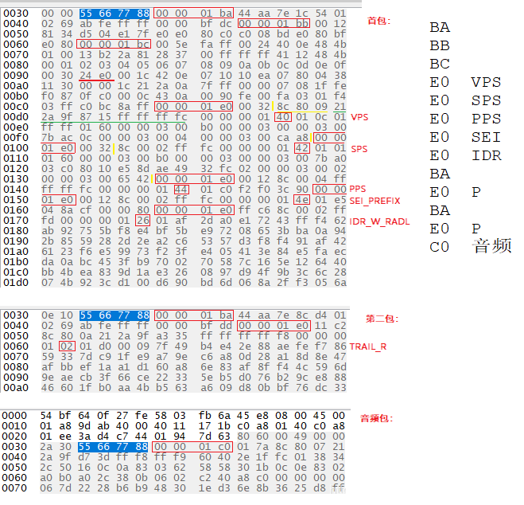
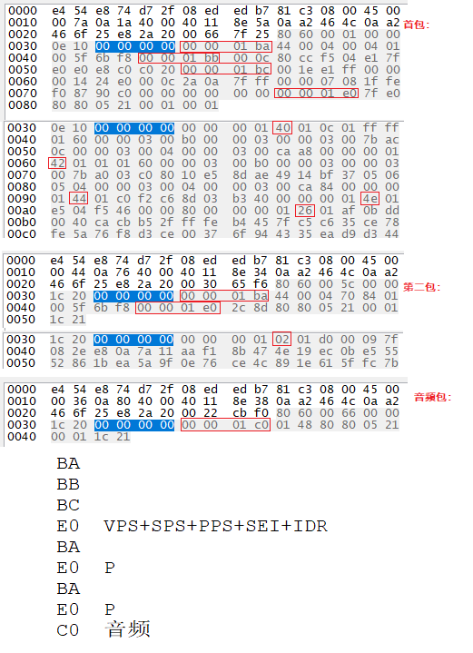

<style>
strong {
    color:#00F9A5;
    size: 100px;
    margin: 0em;
    font-size: xx-large;
    font-style: italic;
}
</style>

### 虾皮视频sdk岗

0. 介绍项目实时对讲和流媒体(针对项目问音频编码 房间创建问题)
   
1. 视频码率控制策略
   H264的三种码率控制方法（***CBR、VBR、CVBR***）

    ***CBR（Constant Bit Rate）是以恒定比特率方式进行编码***，有Motion发生时，由于码率恒定，只能通过增大QP来减少码字大小，图像质量变差，当场景静止时，图像质量又变好，因此图像质量不稳定。这种算法优先考虑码率(带宽)。这个算法也算是码率控制最难的算法了，因为无法确定何时有motion发生，假设在码率统计窗口的最后一帧发生motion，就会导致该帧size变大，从而导致统计的码率大于预设的码率，也就是说每秒统计一次码率是不合理的，应该是统计一段时间内的平均码率，这样会更合理一些。

    ***VBR（Variable Bit Rate）动态比特率***，其码率可以随着图像的复杂程度的不同而变化，因此其编码效率比较高，Motion发生时，马赛克很少。码率控制算法根据图像内容确定使用的比特率，图像内容比较简单则分配较少的码率(似乎码字更合适)，图像内容复杂则分配较多的码字，这样既保证了质量，又兼顾带宽限制。这种算法优先考虑图像质量。

    ***CVBR（Constrained VariableBit Rate）***,这样翻译成中文就比较难听了 ***受限动态比特率***，它是VBR的一种改进方法。但是Constrained又体现在什么地方呢？这种算法对应的Maximum bitRate恒定或者Average BitRate恒定。这种方法的兼顾了以上两种方法的优点：在图像内容静止时，节省带宽，有Motion发生时，利用前期节省的带宽来尽可能的提高图像质量，达到同时兼顾带宽和图像质量的目的。这种方法通常会让用户输入最大码率和最小码率，静止时，码率稳定在最小码率，运动时，码率大于最小码率，但是又不超过最大码率。比较理想的模型如下：

   
2. AnnexB模式和AVCC模式 https://blog.csdn.net/qq_34754747/article/details/122605822
   - ***AnnexB模式***：用起始码分界每一个NALU;
   - **AVCC模式**： 在每个NALU前加一、二、四个长度字节.**NALULengthSizeMinusOne**标识后续每个 NALU 前面前缀（也就是表示长度的整数）的字节数。
   -  一共有两种起始码：3字节的0x000001和4字节的0x00000001
   3字节的0x000001只有一种场合下使用，就是一个完整的帧被编为多个slice的时候，包含这些slice的nalu使用3字节起始码。其余场合都是4字节的。

3. gop opengop closegop
    1. GOP的两种结构
        1. Open-GOP：informal structure. 在一个GOP里面的某一帧在解码时要依赖于前一个GOP中的某一些帧，这种GOP结构叫做Open-GOP。一般码流里面含有B帧的时候才会出现Open-GOP。 例如：IBBPBBP 
        2. Close-GOP: formal structure.在一个GOP里面的某一帧的解码不依赖前一个GOP中的帧。例如：BBIBBPBB，IDR BBPBB
    2. H264中的帧类型主要有五种编码帧：I（IDR帧）、i（非IDR I帧）、P（P帧）、B（参考B帧）、b（非参考B帧）。
        1. **IDR帧，NALU_type = 0x65**。IDR帧是一种特殊的I帧，在解码IDR帧前，清空所有前后向参考缓冲区，IDR帧随后的所有帧不能参考IDR前面的任何帧。IDR帧是视频安全的随机访问点，找到一个IDR帧可以丢弃前面所有帧数据而正确解码。
        2. **i帧是帧内预测帧**，它的解码不依赖与任何其他帧。**NALU_type = 0x61** 。有些解码器没有区分这两种I帧，将所有的i帧都缺省的认为是IDR帧，这样会造成解码错误。这两种i帧在open-GOP的结构中需要明确区分，而在close-GOP中可以视为相同。
        3. **P帧**即前向预测编码图像帧，参考之前的I帧或P帧，**NALU_type = 0x41**。
        4. ***B帧***即双向预测编码图像帧，参考前向或/和后向I帧或P帧。B帧也可以作为参考帧，但一般不常用。B帧提供最高的压缩比，**NALU_type = 0x21 或 0x01**。

4. I p b帧类型 是否可以随意丢弃
   - 00x67: SPS 
   - 0x68: PPS 
   - 0x65: IDR   
   - 0x61: non-IDR Slice
   - 0x01: B Slice
   - 0x06: SEI
   - 0x09: AU Delimiter
  
5. aac 音频 48k flip 双通道 数据大小 格式大小
   -  帧大小计算：
   - 标准AAC采集的PCM16LE原始音频数据，每一帧有1024个采样样本sample，每个采样样本包括左声道2个字节（采样的位数为16位）和右声道2个字节，即一帧大小为4096 bytes。
   - 采样频率为48000HZ，即1秒采集 48000次样本， 所以1秒内有接近48000/1024 = 46帧。一般经过AAC编码压缩后，码率配置为128Kbps，原始音频数据流码率 = 取样频率×采集位数×声道数 = 48000 * 16 * 2 = 1536K。
  
6. gb28181 传输媒体流格式（https://blog.csdn.net/zhangrui_fslib_org/article/details/119428645）
   
   
7. rtp 字段介绍  (**重点看**)
   哪个字段代表流类型(https://blog.csdn.net/chen495810242/article/details/39207305、https://blog.yasking.org/a/hikvision-rtp-ps-stream-parser.html、http://www.javashuo.com/article/p-unskfboj-eg.html)
    1. RTP Header 解析 **（32字节）**
        
        

        1. V: RTP协议版本号，占**2**位。当前协议版本号为2.
        2. P: 填充标志位,,,&emsp;&emsp;占**1**位。如果P=1，则在该报文尾部填充一个或多个额外的八位组，它们不是有效载荷的一部分。
        3. X: 扩展标志位,,,&emsp;&emsp;占**1**位。如果X=1，则在RTP报头后跟一个扩展头
        4. CC：CSRC计数器,，占**4**位。
        5. M: 标记，占1位。不同的载荷不同的含义。对于视频，标记一帧的结束;对于音频，标记会话的开始。
        6. PT：有效载荷类型，占7位。用于说明RTP报文重有效的载荷类型。在流媒体中大部分是用来区分音频流和视频流的，这样便于客户端进行解析。
        7. **序列号，占16位。**
        8. **时间戳，占32位。**
        9. 同步信源标识符：占32位。
        10. 特约信源标识符：占32位。
        11. ***注：基本的RTP说明并不定义任何头扩展本身，如果遇到X=1，需要特殊处理。***

    2. **rtp可以载荷h264裸码流和ps流**。
        1. rtp载荷h264裸码流。荷载格式定义三个不同的基本荷载结构，接收者可以通过RTP荷载的第一个字节后5位（如图2）识别荷载结构。
           - 单个NAL单元包：荷载中只包含一个NAL单元。NAL头类型域等于原始 NAL单元类型,即在范围1到23之间
           - 聚合包：本类型用于聚合多个NAL单元到单个RTP荷载中。本包有四种版本,单时间聚合包类型A (STAP-A)，单时间聚合包类型B (STAP-B)，多时间聚合包类型(MTAP)16位位移(MTAP16), 多时间聚合包类型(MTAP)24位位移(MTAP24)。赋予STAP-A, STAP-B, MTAP16, MTAP24的NAL单元类型号分别是 24,25, 26, 27
           - 分片单元：用于分片单个NAL单元到多个RTP包。现存两个版本FU-A，FU-B,用NAL单元类型 28，29标识 
        2. rtp载荷ps流(https://blog.csdn.net/zhangrui_fslib_org/article/details/119428645)
           - ps封装h265
           - 海康抓包：

                

           - 大华抓包：

             

    
   
8.  rtmp 报文 推拉流过程   ***chunk size大小 128byts*** 
   - 拉流流程
   - 推流流程

9.  c语言函数是否可以重载  
    - c 语言编译出的目标文件只有函数名不带参数 所以是不支持重载的
10. elf文件如何查看其是行86还是x64的 
    - file命令可以查看
    ```shell 
    [ada@ada-pc leetcode]$ file a.out 
    a.out: ELF 64-bit LSB executable, x86-64, version 1 (SYSV), dynamically linked, interpreter /lib64/ld-linux-x86-64.so.2, for GNU/Linux 3.2.0, BuildID[sha1]=5abe7f4532cf0f829633048641449e8be3837709, not stripped
    ```

11. tcp拥塞控制算法   初始发送大小 及阈值大小 及其是控制谁的窗口 mss
    MSS（Maximum Segment Size，最大报文长度），是TCP协议定义的一个选项，MSS选项用于在TCP连接建立时(发送syn 报文)，收发双方协商通信时每一个报文段所能承载的最大数据长度。

12. 低延时 udp相对于tcp优势 
13. tcp send返回值 有哪些 
14. tcp客户端crash掉 服务端会收到哪些消息 什么时候触发的
15. 网络延迟rtt
16. udp最大发送多少字节(https://blog.csdn.net/qq_43684922/article/details/106458445) sendto 500k和100mb区别

    每个 UDP 报文分为 UDP 报头和 UDP 数据区两部分。**(报头由 4 个 16 位长（2 字节）字段组成，分别说明该报文的源端口、目的端口、报文长度和校验值，共8字节)**。
    UDP 报文格式如图所示。

    &emsp;
    
    UDP 报文中每个字段的含义如下：
    1. 源端口：这个字段占据 UDP 报文头的前 16 位，通常包含发送数据报的应用程序所使用的 UDP 端口。接收端的应用程序利用这个字段的值作为发送响应的目的地址。这个字段是可选的，所以发送端的应用程序不一定会把自己的端口号写入该字段中。如果不写入端口号，则把这个字段设置为 0。这样，接收端的应用程序就不能发送响应了。
    2. 目的端口：接收端计算机上 UDP 软件使用的端口，占据 16 位。
    3. 长度：该字段占据 16 位，表示 UDP 数据报长度，***包含 UDP 报文头和 UDP 数据长度***。因为 UDP 报文头长度是 8 个字节，所以这个值最小为 8。
    4. 校验值：该字段占据 16 位，可以检验数据在传输过程中是否被损坏。


    从报文角度解析（报文字段已经硬性规定了这个限制）：
    1. IP报文最大是：**IP包头有一个16bit的长度**，最大值是2^16 -1，也就是说一个IP包整个长度的最大值是： 2^16 - 1  = 65535字节

    2. 因为是UDP，65535字节除去IP头的20个字节，除去UDP头的8个字节，那么最大可发送字节：2^16 - 1 - 20 - 8 字节
    ```c++
    #include <stdio.h>
    #include <stdlib.h>
    #include <string.h>
    #include <sys/socket.h>
    #include <netinet/in.h>
    #include <arpa/inet.h>
    #include <unistd.h>
    #include <errno.h>

    #define MAX 65507

    int main(int argc, char *argv[])
    {
        struct sockaddr_in srvAddr;
        bzero(&srvAddr, sizeof(srvAddr));
        srvAddr.sin_family = AF_INET;
        srvAddr.sin_addr.s_addr = inet_addr("127.0.0.1");
        srvAddr.sin_port = htons(8888);
    
        int fd = socket(AF_INET, SOCK_DGRAM, 0);
        char buff[MAX] = {0};
        int ret = sendto(fd, buff, sizeof(buff), 0, (struct sockaddr *)&srvAddr, sizeof(srvAddr));
        printf("send size is %d, ret is %d\n", sizeof(buff), ret);
        printf("\nthe result : %m\n");
        close(fd);
        return 0;
    }
    ```
    
    ```bash
    luzejia@ubuntu:~$ ./a.out
    send size is 65507, ret is 65507
    the result : Success


    ```


17. ip 数据包格式
    1. 在 TCP/IP 协议中，使用 IP 协议传输数据的包被称为 IP 数据包，每个数据包都包含 IP 协议规定的内容。IP 协议规定的这些内容被称为 IP 数据报文（IP Datagram）或者 IP 数据报。

    2. IP 数据报文由首部（称为报头）和数据两部分组成。首部的前一部分是固定长度，共 20 字节，是所有 IP 数据报必须具有的。在首部的固定部分的后面是一些可选字段，其长度是可变的。

    3. 每个 IP 数据报都以一个 IP 报头开始。源计算机构造这个 IP 报头，而目的计算机利用 IP 报头中封装的信息处理数据。IP 报头中包含大量的信息，如源 IP 地址、目的 IP 地址、数据报长度、IP 版本号等。每个信息都被称为一个字段。

        IP 数据报头字段如图所示

        
        
        IP 报头的最小长度为 20 字节，上图中每个字段的含义如下：
        1.  版本（version）
        占 4 位，表示 IP 协议的版本。通信双方使用的 IP 协议版本必须一致。目前广泛使用的IP协议版本号为 4，即 IPv4。
        1.  首部长度（网际报头长度IHL）
        占 4 位，可表示的最大十进制数值是 15。这个字段所表示数的单位是 32 位字长（1 个 32 位字长是 4 字节）。因此，当 IP 的首部长度为 1111 时（即十进制的 15），首部长度就达到 60 字节。当 IP 分组的首部长度不是 4 字节的整数倍时，必须利用最后的填充字段加以填充。数据部分永远在 4 字节的整数倍开始，这样在实现 IP 协议时较为方便。首部长度限制为 60 字节的缺点是，长度有时可能不够用，之所以限制长度为 60 字节，是希望用户尽量减少开销。最常用的首部长度就是 20 字节（即首部长度为 0101），这时不使用任何选项。
        1. 区分服务（tos）
        也被称为服务类型，占 8 位，用来获得更好的服务。这个字段在旧标准中叫做服务类型，但实际上一直没有被使用过。1998 年 IETF 把这个字段改名为区分服务（Differentiated Services，DS）。只有在使用区分服务时，这个字段才起作用。
        1. 总长度（totlen）
        首部和数据之和，单位为字节。总长度字段为 16 位，因此数据报的最大长度为 2^16-1=65535 字节。
        1. 标识（identification）
        用来标识数据报，占 16 位。IP 协议在存储器中维持一个计数器。每产生一个数据报，计数器就加 1，并将此值赋给标识字段。当数据报的长度超过网络的 MTU，而必须分片时，这个标识字段的值就被复制到所有的数据报的标识字段中。具有相同的标识字段值的分片报文会被重组成原来的数据报。
        1. 标志（flag）
        占 3 位。第一位未使用，其值为 0。第二位称为 DF（不分片），表示是否允许分片。取值为 0 时，表示允许分片；取值为 1 时，表示不允许分片。第三位称为 MF（更多分片），表示是否还有分片正在传输，设置为 0 时，表示没有更多分片需要发送，或数据报没有分片。
        1. 片偏移（offsetfrag）
        占 13 位。当报文被分片后，该字段标记该分片在原报文中的相对位置。片偏移以 8 个字节为偏移单位。所以，除了最后一个分片，其他分片的偏移值都是 8 字节（64 位）的整数倍。
        1. 生存时间（TTL）
        表示数据报在网络中的寿命，占 8 位。该字段由发出数据报的源主机设置。其目的是防止无法交付的数据报无限制地在网络中传输，从而消耗网络资源。路由器在转发数据报之前，先把 TTL 值减 1。若 TTL 值减少到 0，则丢弃这个数据报，不再转发。因此，TTL 指明数据报在网络中最多可经过多少个路由器。TTL 的最大数值为 255。若把 TTL 的初始值设为 1，则表示这个数据报只能在本局域网中传送。 
        1. 协议
        表示该数据报文所携带的数据所使用的协议类型，占 8 位。该字段可以方便目的主机的 IP 层知道按照什么协议来处理数据部分。不同的协议有专门不同的协议号。例如，TCP 的协议号为 6，UDP 的协议号为 17，ICMP 的协议号为 1。
        1.   首部检验和（checksum）
        用于校验数据报的首部，占 16 位。数据报每经过一个路由器，首部的字段都可能发生变化（如TTL），所以需要重新校验。而数据部分不发生变化，所以不用重新生成校验值。
        1.   源地址
        表示数据报的源 IP 地址，占 32 位。
        1.   目的地址
        表示数据报的目的 IP 地址，占 32 位。该字段用于校验发送是否正确。
        1.   可选字段
        该字段用于一些可选的报头设置，主要用于测试、调试和安全的目的。这些选项包括严格源路由（数据报必须经过指定的路由）、网际时间戳（经过每个路由器时的时间戳记录）和安全限制。
        1.   填充
        由于可选字段中的长度不是固定的，使用若干个 0 填充该字段，可以保证整个报头的长度是 32 位的整数倍。
        1.   数据部分
        表示传输层的数据，如保存 TCP、UDP、ICMP 或 IGMP 的数据。数据部分的长度不固定。


18. 进程 线程 协程理解  协程是共享栈。 每个线程都有独立的栈空间。

19. malloc底层实现   malloc500KB和500MB区别
    
    
20. 虚拟地址 物理地址区别 https://blog.csdn.net/ChaseHeart/article/details/120537457
    https://www.cnblogs.com/yige2019/p/15570491.html

    1. 堆和栈的区别
        1. 管理方式不同： 栈是由编译器自动申请和释放空间，堆是需要程序员手动申请和释放；
        2. 空间大小不同： 栈的空间是有限的，在32位平台下，VC6下默认为1M，堆最大可以到4G；
        3. 能否产生碎片： 栈和数据结构中的栈原理相同，在弹出一个元素之前，上一个已经弹出了，不会产生碎片，如果不停地调用malloc、free对造成内存碎片很多；
        4. 生长方向不同： 堆生长方向是向上的，也就是向着内存地址增加的方向，栈刚好相反，向着内存减小的方向生长。
        5.  分配方式不同： 堆都是动态分配的，没有静态分配的堆。栈有静态分配和动态分配。静态分配是编译器完成的，比如局部变量的分配。动态分配由 malloc 函数进行分配，但是栈的动态分配和堆是不同的，它的动态分配是由编译器进行释放，无需我们手工实现。
        6. 分配效率不同： 栈的效率比堆高很多。栈是机器系统提供的数据结构，计算机在底层提供栈的支持，分配专门的寄存器来存放栈的地址，压栈出栈都有相应的指令，因此比较快。堆是由库函数提供的，机制很复杂，库函数会按照一定的算法进行搜索内存，因此比较慢
         
21. mmap理解(https://www.cnblogs.com/huxiao-tee/p/4660352.html)
    
22. tcmalloc jcmalloc 相关几种malloc实现（https://blog.csdn.net/mou_it/category_8507188.html 、https://cloud.tencent.com/developer/article/1173720）
    
23. 100亿视频30万热点如何找出来

24. map删除奇数key
    
    ```c++
    void remove_odd_element(std::map<int,std::string>& ismap){
        for (std::map<int,std::string>::iterator it = ismap.begin(); it !- ismap.end();){
            if (it->key % 2 == 1){
                it = ismap.erase(it);
            }else{
                ++it;
            }
        }
    }
    ```

25. 单例模式
    ```c++
    class Singleton{
        private:
            Singleton(){}
        public:
        static Singleton& getInstance(){
            static Singleton instance;//local static object 双检测所机制
            return instance;
        }
    };
    ```
26. 数组顺时针旋转90度
    ```c
    //5x5数组，顺时针旋转90度。可以把数组看成一个一个嵌套的正方形。一共有matrix.size()/2层。然后顺时针依次交换各边的节点。注意每个边上的节点是在本次循环是行变化还是列变化。
    void roate_arr_90(vector<vector<int>>& matrix){
        int m = matrix.size();
        int n = m;
        
        int len = m /2;
        for (int i = 0; i < len; ++i){
            for (int j = i; j < n-i-1; ++j){
                int tmp = matrix[i][j];
                matrix[i][j] = matrix[m-j-1][i];
                matrix[m-j][i] = matrix[m-i-1][n-j-1];
                matrix[m-i-1][n-j-1] = matrix[j][n-i-1];
                matrix[j][n-i-1] = tmp;
            }
        }
    }
    ```

