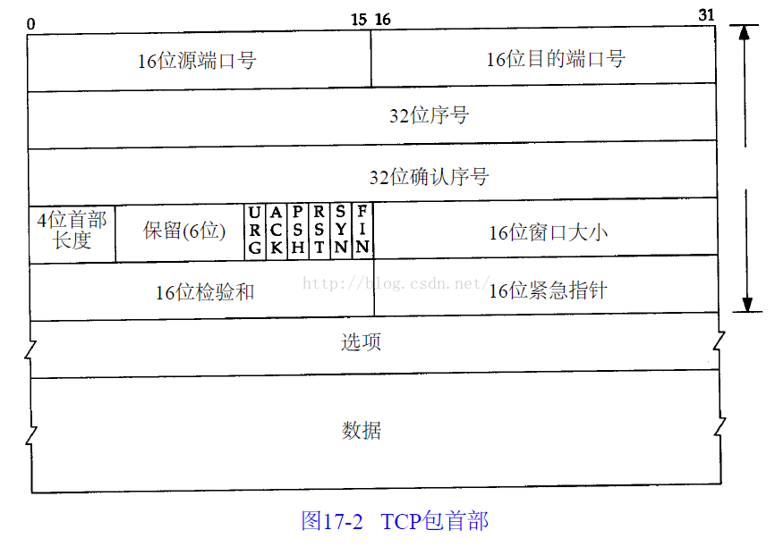
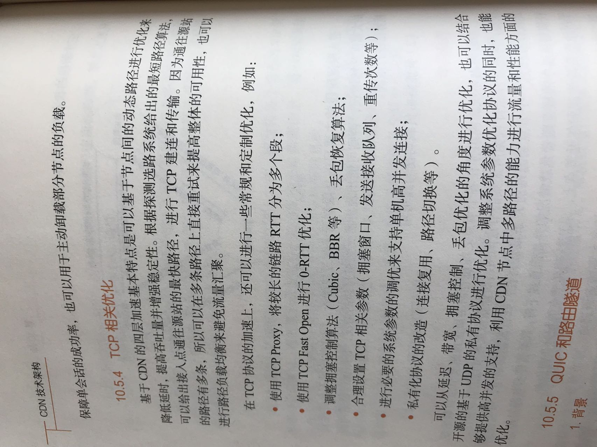
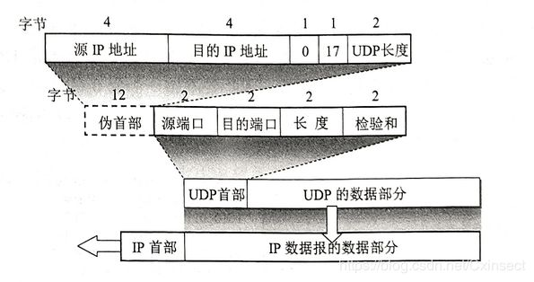

# TCP  
  UDP以其简单、传输快的优势，在越来越多场景下取代了TCP,如实时游戏。  
    （1）网速的提升给UDP的稳定性提供可靠网络保障，丢包率很低，如果使用应用层重传，能够确保传输的可靠性。  
    （2）TCP为了实现网络通信的可靠性，使用了复杂的拥塞控制算法，建立了繁琐的握手过程，由于TCP内置的系统协议栈中，极难对其进行改进。
    采用TCP，一旦发生丢包，TCP会将后续的包缓存起来，等前面的包重传并接收到后再继续发送，延时会越来越大，基于UDP对实时性要求较为严格的情况下，采用自定义重传机制，能够把丢包产生的延迟降到最低，尽量减少网络问题对游戏性造成影响。  
        

 ## 一、TCP 三次握手和四次挥手
    

 ## 二、为什么TCP不适用于实时传输？
- TCP影响实时性不是因为握手消耗时间。握手一开始建立完就没事了  
一般来说，单位时间内传输的数据流量比较平滑。 TCP依赖滑动窗口进行流量控制，滑动窗口大小是自适应的，影响滑动窗口主要有两个因素，一是网络延时，二是传输速率，滑动窗口的大小与延时成正比，与传输速率也成正比。在给定的网络环境下，延时可以认为是固定的，因此滑动窗口仅与传输速率有关，当传输实时数据时，因为数据流通量比较固定，所以这时TCP上的滑动窗口会处于一个不大不小的固定值，这个值大小恰好保证当前生产的数据实时传输到对方，当出现网络丢包时，按TCP协议（快速恢复），滑动窗口将减少到原来的一半，因此速率立刻减半，此时发送速率将小于数据生产速率，一些数据将滞留在发送端，然后滑动窗口将不断增大，直到积累的数据全部发送完毕。上述过程即为典型的TCP流量抖动过程，对于实时传输影响很大，可能形成较大的突发时延，从用户感观角度来说，就是有时比较流畅，但有时卡（“抖一下”，并且比较严重），因此实时传输通常不使用TCP。
    

## 三、TCP 拥塞控制-慢启动、拥塞避免、快重传、快启动
   
    https://blog.csdn.net/jtracydy/article/details/52366461

   **发送方取拥塞窗口与通告窗口中的最小值作为发送上限。拥塞窗口是发送方使用的流量控制，而通告窗口则是接收方使用的流量控制。**

  ***慢启动、拥塞避免、快重传、快启动***
  - **慢启动算法的思路**：主机开发发送数据报时，如果立即将大量的数据注入到网络中，可能会出现网络的拥塞。慢启动算法就是在主机刚开始发送数据报的时候先探测一下网络的状况，如果网络状况良好，发送方每发送一次文段都能正确的接受确认报文段。那么就从小到大的增加拥塞窗口的大小，即增加发送窗口的大小。  **加法增大。**
  - **拥塞避免**：为了防止cwnd增加过快而导致网络拥塞，所以需要设置一个慢开始门限ssthresh状态变量（我也不知道这个到底是什么，就认为他是一个拥塞控制的标识）,它的用法：
     1. 当cwnd < ssthresh,使用慢启动算法，
     2. 当cwnd > ssthresh,使用拥塞控制算法，停用慢启动算法。
     3. 当cwnd = ssthresh，这两个算法都可以。  
     4. 由上可以看出，**执行慢启动和拥塞避免取决于cwnd和ssthreas的关系。**

    拥塞避免的思路:是让cwnd缓慢的增加而不是加倍的增长，每经历过一次往返时间就使cwnd增加1，而不是加倍，这样使cwnd缓慢的增长，比慢启动要慢的多。
    无论是慢启动算法还是拥塞避免算法，**只要判断网络出现拥塞，就要把慢启动开始门限(ssthresh)设置为设置为发送窗口的一半（>=2），cwnd(拥塞窗口)设置为1**，然后在使用慢启动算法，这样做的目的能迅速的减少主机向网络中传输数据，使发生拥塞的路由器能够把队列中堆积的分组处理完毕。拥塞窗口是按照线性的规律增长，比慢启动算法拥塞窗口增长块的多。

    AIMD(加法增大乘法减小)

    1. 乘法减小：无论在慢启动阶段还是在拥塞控制阶段，只要网络出现超时，就是将cwnd置为1，ssthresh置为cwnd的一半，然后开始执行慢启动算法（cwnd<ssthresh）。

    2. 加法增大：当网络频发出现超时情况时，ssthresh就下降的很快，为了减少注入到网络中的分组数，而加法增大是指执行拥塞避免算法后，是拥塞窗口缓慢的增大，以防止网络过早出现拥塞。
    这两个结合起来就是AIMD算法，是使用最广泛的算法。拥塞避免算法不能够完全的避免网络拥塞，通过控制拥塞窗口的大小只能使网络不易出现拥塞。

- **快重传算法要求首先接收方收到一个失序的报文段后就立刻发出重复确认，而不要等待自己发送数据时才进行捎带确认。如果发送方一连收到三个重复的ACK??,那么发送方不必等待重传计时器到期，由于发送方尽早重传未被确认的报文段**

- **快恢复 当发送方连续收到三个重复的ack时???，将慢启动门限值减半，拥塞窗口设置位门限值的一半，然后执行拥塞避免算法。**
    
## 四、 MTU MSS
    https://blog.csdn.net/bian_qing_quan11/article/details/72630354

### 1. MSS的含义  
- 我们知道TCP传输可靠性的保证中有一点是：TCP会将应用层交付下来的数据分为TCP认为最适合发送的数据块。这里的数据块大小就是MSS（maximum segment size最大分段长度）。MSS字段位于TCP首部中的选项字段。
    一句话，MSS就是TCP报文段所允许传送的最大数据部分的长度，如果上层交付下来的数据太大，就对其进行数据分块。这个分块过程是在运输层完成的，在接收端的运输层对分块的TCP报文段的数据部分进行重组。

- 注意：**这个MSS指的是TCP报文段中数据部分的最大长度，并不是整个TCP报文段长度。整个TCP报文段长度 = TCP首部长度 + TCP数据部分长度。**

###    2. 通信双方如何协商MSS
- MSS的值是在TCP三次握手建立连接的过程中，经通信双方协商确定的。我们都知道链路层使用以太网的话，IP层的MTU是1500 byte，这样去掉IP数据报首部（20 byte），在去掉TCP首部（20 byte）后为1460 byte，此时在默认情况下TCP“选项”字段的MSS值为1460 byte = 1500 - 20 - 20。在 Internet 标准中，IP层的MTU是576 byte，那么此时TCP“选项”字段的MSS值为536 byte = 576 - 20 - 20。

    以上是默认情况下一个TCP报文段中的MSS值，下面我们详细说明MSS值的确定过程。

    MSS值只会出现在SYN报文中（不要问我为什么，我也不知道为什么只出现SYN报文中），即SYN=1时，才会有MSS字段值。当客户端想要以TCP方式从服务器端下载数据时，

    （1）首先客户端会发送一个SYN请求报文，这个SYN报文的“选项”字段中会有MSS值（MSS = MUT - IP首部长度 - TCP首部长度）。该MSS值是为了告知对方最大的发送数据大小。

    （2）当服务器端收到SYN报文后，会向请求端返回SYN+ACK（同步确认报文）报文，其中的“选项”字段也会有MSS值。

    （3）通信双方选择SYN和SYN+ACK报文中最小的MSS最为此次TCP连接的MSS，从而达到通信双发协商MSS的效果。

    综上，可以回答开始时的问题。在第二次握手后就可以确定TCP中最大传输报文（MSS）大小。

 ###   3.MTU
- MTU是最大传输单元，这个根据由具体的网络决定的，如以太网MTU=1500，典型Internet协议的MTU=576。

    如果IP层所要传输的数据长度>MTU的话，要对这个数据进行分片处理，每个片长度都小于MTU，每个片构成一个IP数据报进行传输。

    在服务端的IP层使用IP数据报的首部信息对这些分片的IP数据报进行重组。这样使得IP层的分片对传输层看起来是透明的（传输层不知道IP层进行了分片操作）。

### 4.MTU分片的一个问题
- （1）如果IP层每个分片都正确到达目的端，那自然是很好的。但是如果IP层在发送端对要发送的数据（TCP报文段）进行分片操作，但是在传输过程中某个分片发生了错误，这样会使整个TCP报文段重传。因为IP层不负责可靠性（超时和重传），可靠性有传输层提供。

    这也是TCP对数据分段的一个原因，分段后的数据在往下交付后肯定不会超过MTU，这样避免了因为分片而带来的的麻烦。

    （2）如果UDP进行数据传输的话，UDP将应用层交付下来的整个数据封装为UDP数据报（没有像TCP分块的操作）。这样IP层的数据很容易超过MTU，造成数据分片。而TCP的数据分块，不会导致IP层的分片。

    **总的来说UDP不会分段，就由IP来分片。TCP分段，也就不用IP来分片了！**

###    总结：
- IP分片是由于传输的数据超过了MTU，TCP分块是由于数据超过了MSS。
- IP分片是在发送端的网络层中进行的，IP重组是在接收端的网络层中，根据IP首部完成的。TCP数据分块是在发送端的传输层进行的，TCP重组是在接收端的传输层完成的。IP层的分片与重组对传输层是透明的。
一般情况下，使用UDP、ICMP发送数据时，在网络层要进行分片。而使用TCP传输的话，TCP的MSS分块避免了分片。

## TCP相关优化

# UDP

UDP 报文格式
每个 UDP 报文分为 UDP 报头和 UDP 数据区两部分。报头由 4 个 16 位长（2 字节）字段组成，分别说明该报文的源端口、目的端口、报文长度和校验值。

UDP 报文格式如图所示。  

UDP 报文中每个字段的含义如下：  
- 源端口：这个字段占据 UDP 报文头的前 16 位，通常包含发送数据报的应用程序所使用的 UDP 端口。接收端的应用程序利用这个字段的值作为发送响应的目的地址。这个字段是可选的，所以发送端的应用程序不一定会把自己的端口号写入该字段中。如果不写入端口号，则把这个字段设置为 0。这样，接收端的应用程序就不能发送响应了。
- 目的端口：接收端计算机上 UDP 软件使用的端口，占据 16 位。
- 长度：该字段占据 16 位，表示 UDP 数据报长度，包含 UDP 报文头和 UDP 数据长度。因为 UDP 报文头长度是 8 个字节，所以这个值最小为 8。
- 校验值：该字段占据 16 位，可以检验数据在传输过程中是否被损坏。
- 每个UDP的首部前面会额外的增加一个伪首部，用作传输层数据报的差错校验。下面我们来剖析一下UDP，看一下它的首部构造.
  